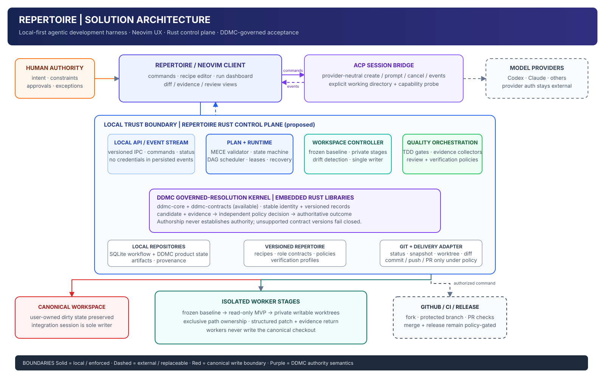
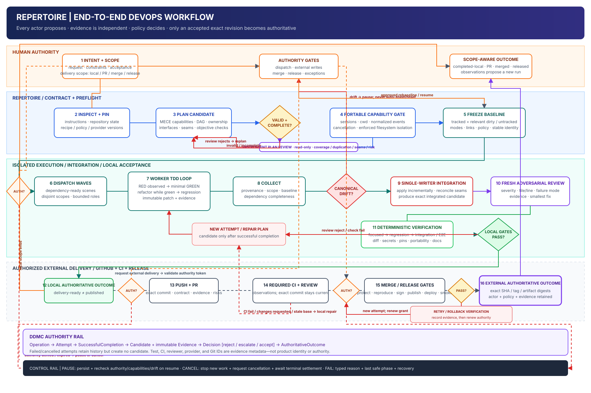
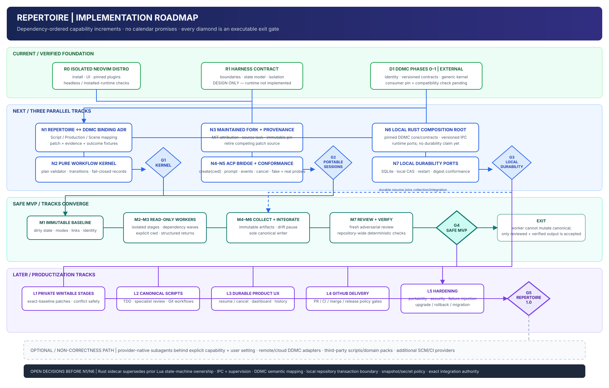

# Repertoire architecture diagrams

Status: proposed solution architecture and delivery contract; not implemented.

Repertoire is a local-first agentic software-development harness presented
through Neovim. It makes the orchestrator-worker pattern canonical for planning,
TDD, code review, Git management, verification, and delivery. The diagrams in
this directory are the discussion artifacts for finalizing that system before
implementation begins.

Each SVG is a directly reviewable rendering. Select it to open the corresponding
editable Draw.io source. The Draw.io file is the editable semantic authority;
its SVG projection must be updated and reviewed in the same change.

## Solution architecture

The target composition has a thin Repertoire Neovim client and a local Rust
control plane. The client owns interaction and the provider-neutral ACP session
bridge. The Rust process owns the durable workflow state machine, capability
plan validation, scheduling, workspace isolation, Git integration, quality
gates, and recovery.

Repertoire embeds the available `ddmc-core` and `ddmc-contracts` libraries as a
governed-resolution kernel. DDMC owns stable identity and the
candidate → evidence → decision → outcome authority model. Repertoire owns
workflow execution. A successful agent, test command, review, or CI run supplies
a candidate or evidence; it does not make a result authoritative by itself.

The architecture deliberately does not claim that DDMC currently supplies a
local workflow or persistence service. Repertoire must implement those adapters
against explicit ports and conformance tests. Later DDMC implementations may
replace them without changing the Repertoire domain contract.

## End-to-end DevOps workflow

The workflow begins with human intent and ends at the delivery scope explicitly
authorized for the run: a verified local result, pull request, merged revision,
or release. Planning output and agent output are untrusted inputs. Mechanical
plan validation, independent plan review, provider capability checks, filesystem
isolation, canonical-drift detection, fresh code review, and deterministic
verification are explicit gates.

Workers never write the canonical checkout. The correctness-first MVP uses
read-only isolated stages that return structured patch proposals and evidence.
A later stage may use private writable worktrees. In both cases, one integration
controller is the sole canonical writer, and canonical drift pauses the run
instead of triggering an automatic stash, reset, checkout, or overwrite.

Every correction starts a new attempt; only a successful completion creates a
candidate. Rejected work and failed or cancelled attempts remain in history.
Recipes, prompts, policies, and gates do not silently self-modify from run
telemetry; improvements enter the same governed workflow as new versioned
changes.

## Implementation roadmap

The roadmap is dependency-ordered rather than date-based. It distinguishes the
verified foundations from proposed work:

- The isolated Neovim distribution and foundational harness design exist.
- DDMC Phases 0–1 supply usable identity and contract libraries in the sibling
  DDMC project. Repertoire has not yet pinned or compatibility-tested them.
- The Repertoire runtime, DDMC software-delivery binding, local persistence,
  artifact store, ACP conformance bridge, enforced worker isolation, and DevOps
  workflows remain to be implemented.

The first executable product milestone is a safe read-only-worker MVP. Its exit
test must demonstrate that a worker cannot mutate canonical state and that only
an independently reviewed and verified integrated revision can become an
accepted local outcome. Private writable workers, full GitHub delivery,
persistent UX, and hardening build on that invariant rather than precede it.

### Executable roadmap gates

| Gate | Observable exit condition |
| --- | --- |
| G1 — Kernel | Provider-free tests reject malformed plans, exhaustively validate legal transitions, and verify versioned Repertoire-to-DDMC fixtures. |
| G2 — Portable sessions | Every enabled provider passes the same explicit-working-directory, terminal-event, cancellation, independent-session, and isolation contract. |
| G3 — Local durability | Run state and immutable artifacts survive restart, duplicate operations converge, and stored bytes match recorded digests. |
| G4 — Safe MVP | An adversarial end-to-end test proves workers cannot mutate the canonical checkout and only fresh-reviewed, deterministically verified integration can be accepted. |
| G5 — Repertoire 1.0 | A production-shaped change completes TDD, review, GitHub delivery, persistence/recovery, and the portability matrix with a complete evidence-backed run record. |

The DDMC consumer pin is a prerequisite of N6, not a current Repertoire
dependency. DDMC currently documents Rust 1.94.1 and Phase 1 revision
`2631fa6ab4b72c1592d525ddc2272f95063b1c3e`; N6 must select an immutable reviewed
revision and add a compatibility check rather than inheriting that example pin
implicitly.

## Proposed vocabulary and precise model

The theatre vocabulary belongs to the product experience; persisted contracts
retain precise technical terms.

| Repertoire term | Precise workflow/DDMC meaning |
| --- | --- |
| Script | Versioned workflow recipe and policy bindings |
| Production | One requested workflow run |
| Scene | One capability or stage occurrence |
| Cast | Bounded orchestrator, worker, integrator, and reviewer roles |
| Stage | An isolated repository workspace |
| Cue | A dependency, approval, or policy gate |
| Rehearsal | TDD and preflight verification activity |
| Notes | Structured review findings |
| Outcome | The exact accepted local revision, PR, merge, or release result |

The initial DDMC domain binding should map a Production to a `Run`, a Scene to
an `Operation`, an execution try to an `Attempt`, an exact plan/patch/revision to
a `Candidate`, test and review records to `Evidence`, a gate disposition to an
`AcceptanceDecision`, and the selected delivery result to an
`AuthoritativeOutcome`. This mapping remains proposed until an ADR and executable
contract fixtures adopt it.

## Decisions to settle before implementation

1. Adopt the Rust sidecar as authoritative workflow owner and supersede the
   earlier Lua-owned state-machine design.
2. Choose and version the Neovim-to-Rust IPC transport, supervision, restart,
   backpressure, and failure behavior.
3. Define the exact DDMC binding for capability fan-out, joins, repair loops,
   Git revisions, and scope-aware delivery outcomes.
4. Choose the local transaction boundary across workflow history, DDMC product
   state, and content-addressed artifacts.
5. Specify snapshot inclusion, ignored-file, nested-repository, submodule,
   symlink, file-mode, large-file, and secret-handling policy.
6. Decide whether the sole writer is a privileged integration agent in the
   canonical checkout or a deterministic patch applier followed by integration
   in another private workspace.
7. Define command, network, environment, credential, and resource policies per
   role.
8. Define which local and GitHub actions may use standing recipe authority and
   which always require an interactive human decision.

The existing [orchestration harness contract](orchestration-harness.md) and
[upstream strategy](upstream-strategy.md) remain source material. They still use
the pre-Repertoire name and assume a Neovim-owned state machine; those documents
must be reconciled only after the first decision above is accepted.
